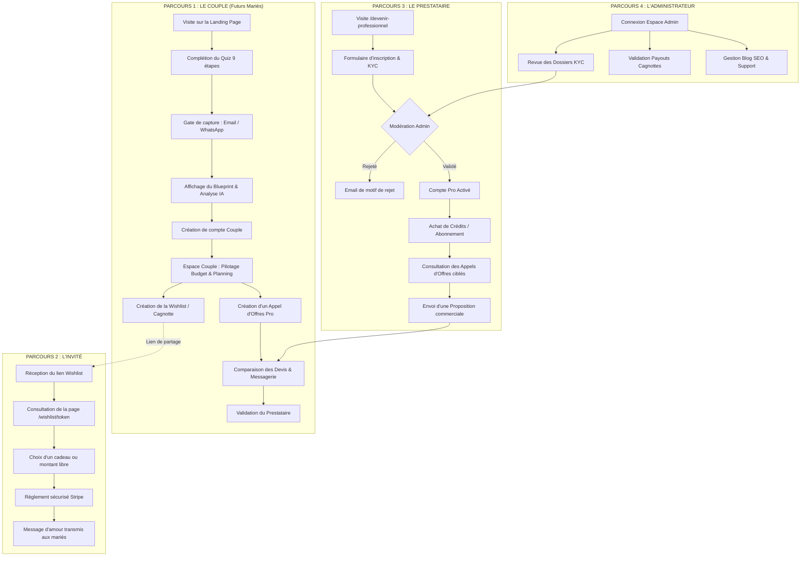

# 💍 Wedding AI Builder — Audit Global, Analyse Fonctionnelle & Cartographie des Workflows

> **Date du document** : Septembre 2026  
> **Auteur** : Audit IA & Architecture Produit  
> **Projet** : Wedding AI Builder (`wedding-ai-builder`)  

---

## Sommaire

1. [Synthèse Exécutive & Présentation Générale](#1-synthèse-exécutive--présentation-générale)
2. [Audit Technique & Architectural](#2-audit-technique--architectural)
   - 2.1 Stack technologique & Dépendances
   - 2.2 Points forts de l'implémentation
   - 2.3 Points de vigilance & Dette technique
3. [Analyse Fonctionnelle Exhaustive](#3-analyse-fonctionnelle-exhaustive)
   - 3.1 Tunnel d'Acquisition & Espace Marketing
   - 3.2 L'Espace Couple & Outils de Pilotage
   - 3.3 L'Espace Prestataire & Monétisation B2B
   - 3.4 L'Espace Administrateur & Back-Office
4. [Cartographie des Workflows & Cheminements Utilisateurs (User Journeys)](#4-cartographie-des-workflows--cheminements-utilisateurs-user-journeys)
   - 4.1 Parcours 1 : Les Futurs Mariés (De la découverte au mariage)
   - 4.2 Parcours 2 : L'Invité (Consultation & Paiement Cagnotte)
   - 4.3 Parcours 3 : Le Prestataire (Candidature, Devis & Monétisation)
   - 4.4 Parcours 4 : L'Administrateur (Modération KYC & Supervision)
5. [Évaluation Globale, Avis & Appréciations](#5-évaluation-globale-avis--appréciations)
6. [Feuille de Route & Recommandations Stratégiques](#6-feuille-de-route--recommandations-stratégiques)
   - 6.1 Court Terme (Quick Wins & Sécurité)
   - 6.2 Moyen & Long Terme (Différenciation & Scalabilité)

---

## 1. Synthèse Exécutive & Présentation Générale

**Wedding AI Builder** est une plateforme SaaS / Marketplace novatrice qui modernise et simplifie l'organisation de mariage grâce à l'association de l'**Intelligence Artificielle Générative** et d'un **Matching algorithmique géolocalisé**.

La plateforme s'adresse à trois populations distinctes avec des propositions de valeur complémentaires :
1. **Les Futurs Mariés (Couples B2C)** : Réduire l'anxiété et le temps passé à organiser leur mariage grâce à un audit budgétaire immédiat, un concept créatif sur-mesure (*Wedding Blueprint*), un rétroplanning interactif, une cagnotte en ligne et des recommandations de prestataires ultra-pertinents.
2. **Les Prestataires de Mariage (Professionnels B2B)** : Accéder à un flux continu de prospects qualifiés dans leur zone géographique avec un taux de compatibilité calculé par l'IA, sans commission cachée mais via un modèle transparent de crédits et d'abonnements.
3. **Les Invités du Mariage** : Participer simplement et en toute sécurité aux cadeaux ou à la cagnotte voyage de noces des mariés avec un paiement par carte bancaire (Stripe).

---

## 2. Audit Technique & Architectural

### 2.1 Stack Technologique & Dépendances

| Couche | Technologies Utilisées | Commentaires / Rôles |
| :--- | :--- | :--- |
| **Framework Web** | Next.js 14 (App Router), React 18 | Rendu hybride (Server/Client Components), Route Groups modulaires |
| **Langage & Typage** | TypeScript 5.5, Zod 3.23 | Typage statique exhaustif et validation runtime des schémas IA et formulaires |
| **Design & UI** | Tailwind CSS 3.4, Framer Motion 11, Lucide React | Expérience utilisateur fluide, responsive et micro-animations soignées |
| **Base de Données** | Firebase Cloud Firestore & Local File Store (`.data/`) | Pattern Repository isolant l'accès aux données. Fallback local pour le dev |
| **Intelligence Artificielle**| OpenAI SDK (`gpt-4o` / modèles configurables) | Découpage des prompts (Blueprint, Budget, Timeline, Risk Engine) |
| **Paiements** | Stripe SDK (Checkout, Webhooks, Customer Portal) | Gestion des abonnements pros, packs de crédits et contributions wishlist |
| **Cartographie & Géo** | Leaflet, Formule Haversine personnalisée | Calculs kilométriques réels pour filtrer les prestataires par zone |
| **Emails** | Resend, Nodemailer | Envoi des confirmations de commande, alertes leads et réinitialisations de mot de passe |
| **Stockage Médias** | Cloudinary | Upload optimisé des portfolios, logos et justificatifs KYC |

### 2.2 Points Forts de l'Implémentation
* **Pattern Fallback IA Déterministe (`lib/ai/fallback.ts`)** : C'est l'un des atouts techniques majeurs du projet. Si la clé API OpenAI est absente, épuisée ou en panne, l'application ne plante jamais : elle bascule instantanément sur un moteur heuristique qui calcule des ventilations budgétaires, des délais et des scores de risques cohérents et personnalisés selon les réponses du quiz.
* **Moteur de Matching Hybride (`lib/matching/engine.ts`)** : 
  * Calcul de distance géographique réel basé sur les coordonnées GPS (Haversine).
  * Pondération paramétrable (règles métier déterministes vs pertinence sémantique IA).
  * Plafonds de scores automatiques en cas d'incompatibilité budgétaire ou géographique.
* **Architecture Repository Propre (`lib/db/repositories/`)** : Les 21 repositories isolent entièrement la logique métier du moteur de persistance. Changer de base de données à l'avenir (par exemple vers Supabase ou PostgreSQL) ne nécessiterait aucune réécriture des contrôleurs d'API.
* **Sécurité Stateless Légère (`lib/auth.ts`)** : Authentification basée sur des cookies HTTP-Only signés en HMAC-SHA256 avec salage PBKDF2, évitant la lourdeur d'une dépendance externe complexe comme NextAuth ou Supabase Auth tout en restant maîtrisée.

### 2.3 Points de Vigilance & Dette Technique
* **Persistance Locale (`localStore.ts`) vs Production Serverless** : Le système de stockage local dans le dossier `.data/` est pratique en local mais éphémère en hébergement serverless (Vercel). Un garde-fou (`guardProductionStore`) est en place, mais il est capital de s'assurer que les variables Firebase (`FIREBASE_PROJECT_ID`, `FIREBASE_CLIENT_EMAIL`, `FIREBASE_PRIVATE_KEY`) soient toujours renseignées sur les environnements de staging/production.
* **Middleware d'Authentification** : Le fichier `middleware.ts` ne filtre actuellement que les accès à `/result/` avec un cookie de capture lead. Les routes des espaces couple et prestataire vérifient la session côté client ou dans les routes API. Pour une sécurité renforcée et un chargement plus rapide sans clignotement, la vérification du token de session devrait être opérée dès le middleware.
* **Payouts des Cagnottes (Virements bancaires)** : Les reversements des fonds collectés vers les comptes bancaires des mariés sont actuellement suivis en base via `WishlistPayout` et nécessitent une intervention administrative. L'intégration de **Stripe Connect** permettra d'automatiser et de sécuriser ces transferts tout en respectant scrupuleusement la réglementation financière européenne (DSP2).

---

## 3. Analyse Fonctionnelle Exhaustive

### 3.1 Tunnel d'Acquisition & Espace Marketing

```
Accueil (Landing Page) ──► Quiz (9 étapes) ──► Gate (Lead Magnet) ──► Rapport IA (Blueprint) ──► Inscription Couple
```

1. **Landing Page d'Accueil (`/`)** :
   * Présentation forte de la promesse : *"Organisez le mariage de vos rêves avec l'intelligence artificielle"*.
   * Call to action principal vers le Quiz interactif.
   * Présentation des avantages, témoignages et aperçu des fonctionnalités.
2. **Quiz Personnalisé en 9 Étapes (`/quiz`)** :
   * **Étape 1 : Date** (Date précise, période approximative ou "pas encore fixée").
   * **Étape 2 : Lieu** (Ville et pays de célébration).
   * **Étape 3 : Effectif** (Nombre d'invités adultes et nombre d'enfants).
   * **Étape 4 : Budget** (Montant global et devise sélectionnée).
   * **Étape 5 : Style & Thème** (Bohème, Classique, Moderne, Rustique, Luxe, etc. avec saisie libre et ambiance).
   * **Étape 6 : Catégories prioritaires** (Lieu, Traiteur, Photo, Vidéo, DJ, Fleurs, Déco, Tenues, etc.).
   * **Étape 7 : Besoins spécifiques** (Régimes alimentaires : halal, casher, vegan, sans gluten ; mobilité réduite ; invités venant de loin).
   * **Étape 8 : Priorité n°1** (Respect strict du budget, cadre exceptionnel, expérience invités, zéro stress).
   * **Étape 9 : Niveau d'anxiété** (Curseur d'évaluation du stress ressenti de 1 à 10).
3. **Le "Gate" d'Acquisition (`/gate`)** :
   * Point de capture lead : l'utilisateur renseigne son prénom, son email et éventuellement son numéro WhatsApp avant de débloquer son audit complet.
   * Consentement marketing RGPD explicite.
4. **Le Résultat & Rapport Interactif (`/result/[sessionId]`)** :
   * **Concept & Storytelling** : Synthèse poétique et émotionnelle du thème du mariage.
   * **Palette de Couleurs** : Nuancier harmonieux généré par l'IA avec codes HEX et explications stylistiques.
   * **Ventilation Budgétaire Experte** : Diagrammes et jauges par poste avec estimation réaliste des min/max du marché et détection des marges de manœuvre ou des risques de dépassement.
   * **Rétroplanning Mois par Mois** : Jalons clés et prochaines étapes critiques.
   * **Score de Risque Organisationnel** : Évaluation sur 100 avec détail des vulnérabilités (météo, délais prestataires, budget trop serré) et solutions correctives.
   * **Scénarios Alternatifs d'Économie** : Recommandations pour réduire la facture globale sans dégrader l'expérience des invités.
5. **Pages Publiques Annexes** :
   * **Annuaire Prestataires (`/prestataires`)** : Moteur de recherche public avec filtres.
   * **Devenir Professionnel (`/devenir-professionnel`)** : Page de vente B2B mettant en avant l'acquisition de mariages qualifiés.
   * **Blog (`/blog`)** : Hub de contenu SEO pour capter le trafic de recherche naturel.

---

### 3.2 L'Espace Couple & Outils de Pilotage (`/espace-couple`)

* **Tableau de Bord & Vue d'Ensemble** : Synthèse de l'état d'avancement, prochaines tâches urgentes et alertes budgétaires.
* **Mon Mariage & Blueprint (`/mariage`)** : Fiche récapitulative du projet de mariage et consultation permanente du dossier IA.
* **Gestionnaire Budgétaire Avancé (`/budget`)** :
  * Visualisation du budget prévu vs engagé vs payé.
  * Ajout, modification et catégorisation des dépenses réelles.
  * Identification instantanée des surplus ou déficits par catégorie.
* **Rétroplanning Interactif (`/planning`)** :
  * Check-list chronologique avec statut (à faire, en cours, terminé).
  * Création de tâches personnalisées avec échéances et priorités.
* **Gestion des Témoins & Équipe (`/mariage`)** :
  * Annuaire des témoins, demoiselles/garçons d'honneur et coordinateurs du jour J.
  * Attribution des rôles et centralisation des coordonnées d'urgence.
* **Marketplace & Appels d'Offres Prestataires (`/prestataires`)** :
  * Consultation des prestataires recommandés par l'algorithme IA.
  * Lancement d'appels d'offres ciblés (*Tenders*) par catégorie de prestation.
  * Comparateur de devis reçus et consultation des portfolios.
* **Messagerie Instantanée (`/messagerie`)** :
  * Fil de discussion sécurisé avec les prestataires retenus.
  * Envoi et réception de pièces jointes (devis, plaquettes, photos d'inspiration).
* **Liste de Souhaits & Cagnotte en Ligne (`/liste-souhaits`)** :
  * Création d'une cagnotte pour le voyage de noces ou d'une liste de cadeaux individualisés.
  * Personnalisation de la photo de couverture et du message d'accueil.
  * Génération d'une URL de partage publique (`/wishlist/[shareToken]`).
  * Suivi en temps réel des participations financières reçues et des messages d'invités.
  * Demande de versement des fonds (*Payout*) vers le compte bancaire.
* **Coffre-fort Documents (`/documents`)** :
  * Téléversement et classement des contrats, factures et autorisations.

---

### 3.3 L'Espace Prestataire & Monétisation B2B (`/espace-prestataire`)

* **Profil & Vitrine Commerciale (`/profil`, `/portfolio`)** :
  * Identité de l'entreprise (Nom, SIRET vérifié, bio, coordonnées).
  * Galerie multimédia (photos HD, vidéos, avis clients certifiés, FAQ).
  * Paramétrage de la zone d'intervention (rayon kilométrique d'action autour du siège).
  * Fourchettes tarifaires indicatives et styles maîtrisés.
* **Gestion des Disponibilités (`/calendrier`)** :
  * Déclaration des saisons de pointe et blocage des dates déjà complètes.
* **Flux d'Opportunités & Appels d'Offres (`/appels-offres`)** :
  * Flux en temps réel des mariages organisés dans le rayon d'action du pro.
  * Affichage du score de compatibilité calculé par l'IA et analyse des besoins exprimés par le couple.
* **Système de Crédits & Monétisation (`/credits`, `/offres`)** :
  * **Modèle Pay-to-Pitch** : Le prestataire dépense des crédits pour soumettre une offre commerciale personnalisée à un appel d'offres.
  * Achat de packs de crédits ponctuels ou souscription d'abonnements mensuels via Stripe Customer Portal.
  * Historique transparent des transactions de crédits (achats, dépenses, remboursements en cas d'annulation).
* **Gestion des Devis & Propositions (`/propositions`)** :
  * Suivi des propositions transmises aux couples (en attente, acceptée, déclinée).
  * Relances et dialogue via la messagerie interne.
* **Boutique Idées Cadeaux (`/cadeaux`)** :
  * Possibilité pour certains corps de métier de suggérer leurs créations ou services directement dans le catalogue de cadeaux des mariés.

---

### 3.4 L'Espace Administrateur & Back-Office (`/admin`)

* **Tableau de Bord Métriques (KPIs)** :
  * Volume d'affaires global généré (Stripe).
  * Nombre de couples actifs, projets créés et sessions quiz finalisées.
  * Nombre de prestataires enregistrés et dossiers en attente.
  * Taux de conversion du lead gate vers la création de compte.
* **Modération KYC des Candidatures Prestataires (`/candidatures`)** :
  * Vérification humaine obligatoire avant publication d'un profil pro.
  * Examen du numéro SIRET, de la conformité juridique et de la qualité visuelle du portfolio.
  * Validation ou refus motivé avec notification par email.
* **Gestion des Cagnottes & Payouts (`/cagnottes`)** :
  * Contrôle des montants collectés par les couples.
  * Validation et exécution des virements bancaires des cagnottes vers les mariés.
* **Gestion des Utilisateurs & Rôles (`/utilisateurs`)** :
  * Hiérarchie administrative avec droits d'accès différenciés : `superadmin`, `moderator`, `support`, `commercial`.
* **CMS Blog & Référencement (`/blog`)** :
  * Rédaction, publication et mise en page des articles de blog pour le SEO.
* **Support Client (`/support`)** :
  * Traitement des demandes d'assistance des couples et des prestataires.

---

## 4. Cartographie des Workflows & Cheminements Utilisateurs (User Journeys)



### 4.1 Parcours 1 : Les Futurs Mariés (De la découverte au mariage)
1. **Découverte** : Le couple arrive sur la plateforme via les réseaux sociaux, le bouche-à-oreille ou le référencement Google.
2. **Diagnostic IA** : Attiré par la gratuité de l'audit de mariage, il renseigne ses préférences dans le quiz (budget, ville, style, effectif, angoisses).
3. **Conversion Lead** : Pour accéder à son diagnostic chiffré, il saisit son email sur l'écran intermédiaire.
4. **Prise de conscience ("Aha! Moment")** : Il découvre son *Wedding Blueprint* : une vision claire de son mariage, une palette de couleurs élégante, et surtout une mise en garde sur les postes où son budget risque d'exploser.
5. **Adoption de la plateforme** : Il crée son mot de passe pour enregistrer ce projet et le partager avec son/sa partenaire.
6. **Gestion opérationnelle** :
   * Chaque semaine, il consulte son rétroplanning et valide ses jalons.
   * Il enregistre ses acomptes dans l'outil budgétaire.
   * Il lance un appel d'offres pour trouver son traiteur ou son photographe.
7. **Monétisation collaborative** : Il configure sa cagnotte voyage de noces et intègre le lien sur ses faire-part.

---

### 4.2 Parcours 2 : L'Invité au Mariage
1. **Accès** : L'invité clique sur le lien reçu par message ou scanne le QR code imprimé sur le carton d'invitation (`/wishlist/[shareToken]`).
2. **Consultation** : Il découvre la page publique personnalisée avec la photo des fiancés et leur mot d'accueil.
3. **Sélection** : Il choisit un cadeau précis (ex: "Une nuit d'hôtel en lune de miel") ou verse un montant libre.
4. **Paiement** : Il saisit ses coordonnées bancaires sur le formulaire Stripe sécurisé et rédige un message de félicitations.
5. **Bouclage** : L'invité reçoit son reçu par email ; la cagnotte des mariés est immédiatement créditée et ces derniers peuvent lire le mot d'encouragement.

---

### 4.3 Parcours 3 : Le Prestataire Professionnel (Vendor)
1. **Acquisition B2B** : Attiré par la promesse de recevoir des demandes qualifiées sans commission à la vente, le prestataire s'inscrit sur `/devenir-professionnel`.
2. **Dépôt du dossier légal** : Il renseigne son numéro SIRET, téléverse son attestation d'assurance, définit son rayon de mobilité et expose ses plus belles réalisations.
3. **Vérification** : Son dossier est étudié par l'équipe administrative de Wedding AI Builder.
4. **Activation & Rechargement** : Une fois approuvé, il accède à son espace pro et fait l'acquisition d'un pack de crédits.
5. **Veille & Candidature** : Il reçoit des notifications dès qu'un mariage correspond à ses critères. Il consulte la fiche projet et utilise ses crédits pour formuler un devis adapté.
6. **Contractualisation** : Le couple ouvre la discussion via la messagerie interne pour finaliser la prestation.

---

### 4.4 Parcours 4 : L'Administrateur de la Plateforme
1. **Pilotage quotidien** : Consultation du tableau de bord pour monitorer la santé économique de la plateforme (nouveaux inscrits, crédits consommés, montants en cagnotte).
2. **Contrôle KYC** : Vérification minutieuse des nouvelles entreprises postulantes pour garantir aux mariés des prestataires fiables et légalement enregistrés.
3. **Gestion des reversements de cagnottes** : Examen des demandes de versement émises par les couples, contrôle de l'identité du bénéficiaire et exécution des virements bancaires.
4. **Animation éditoriale** : Publication de nouveaux guides sur le blog pour soutenir le SEO.

---

## 5. Évaluation Globale, Avis & Appréciations

| Critère | Note | Commentaire & Appréciation |
| :--- | :---: | :--- |
| **Proposition de Valeur** | **9.5/10** | L'alignement produit/marché est remarquable : l'organisation de mariage est l'un des événements les plus anxiogènes et coûteux d'une vie, et l'IA apporte un cadrage immédiat et rassurant. |
| **Architecture & Robustesse** | **9/10** | Excellente qualité de code avec Next.js 14, typage TypeScript intégral et séparation nette des responsabilités via le pattern Repository. |
| **Résilience Technique de l'IA** | **9.5/10** | Le moteur de fallback déterministe (`fallback.ts`) garantit que le produit reste 100% opérationnel même en cas de défaillance des services OpenAI. |
| **Design & Identité Visuelle** | **8.5/10** | Palette de couleurs douce et élégante, hiérarchie visuelle claire et animations soignées avec Framer Motion. |
| **Modèle Économique (Business Model)** | **9/10** | Modèle hybride très résilient combinant commission/frais de service sur les cagnottes B2C et modèle d'abonnements/crédits B2B côté prestataires. |

---

## 6. Feuille de Route & Recommandations Stratégiques

### 6.1 Court Terme (Quick Wins & Sécurité)
1. **Automatisation des Payouts via Stripe Connect** :
   * Remplacer le système actuel de virement manuel par **Stripe Connect Express**.
   * Les couples renseignent directement leur IBAN sur une interface sécurisée Stripe, et les fonds sont débloqués en un clic dans le respect strict des réglementations européennes anti-blanchiment.
2. **Renforcement du Middleware d'Authentification** :
   * Centraliser la protection des routes privées dans `middleware.ts` pour interdire l'accès à `/espace-couple/*` et `/espace-prestataire/*` aux utilisateurs non connectés, éliminant tout clignotement à l'écran.
3. **Alertes Multicanales (SMS / WhatsApp)** :
   * Intégrer l'API WhatsApp Business (Twilio ou Meta Cloud API) pour alerter les mariés en temps réel dès qu'un prestataire répond à leur appel d'offres.

### 6.2 Moyen & Long Terme (Différenciation & Scalabilité)
1. **Copilote IA Conversationnel 24/7** :
   * Intégrer dans l'espace couple un assistant conversationnel contextuel capable de répondre aux interrogations des mariés en s'appuyant sur les données spécifiques de leur projet (*"Compte tenu de mes 120 invités, combien de bouteilles de champagne dois-je prévoir ?"*).
2. **Génération Visuelle de Moodboard IA** :
   * Utiliser des modèles d'image (ex: Imagen ou DALL-E) pour matérialiser en visuel réaliste les recommandations de décoration et d'arches florales suggérées par la palette de couleurs.
3. **Plan de Table 2D Interactif (Drag & Drop)** :
   * Offrir un outil de disposition visuelle des tables (rondes, rectangulaires) avec placement des invités, gestion des enfants et suivi des régimes alimentaires pour le traiteur.
4. **Export PDF Professionnel du Blueprint** :
   * Permettre aux mariés de télécharger en un clic un dossier de synthèse PDF haute définition à imprimer ou à transmettre directement à leur wedding planner physique.
